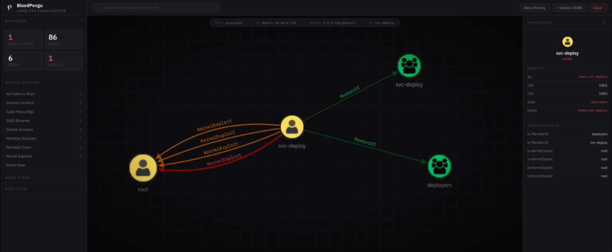
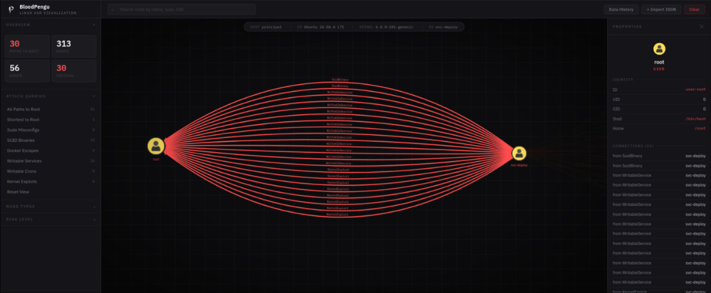
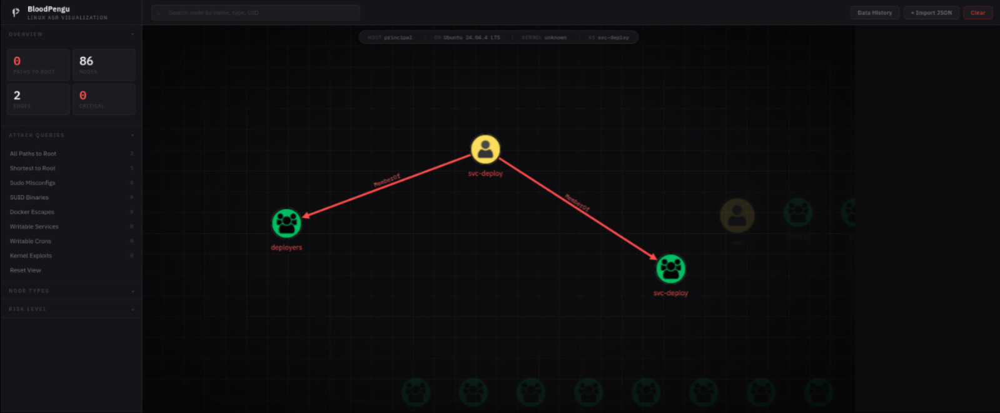
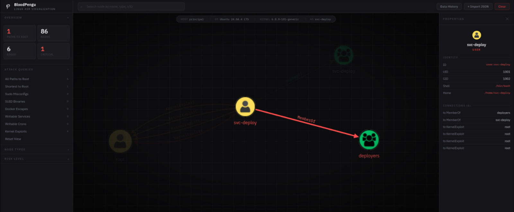

<p align="center">
    <picture>
        
    </picture>
</p>

<hr/>

BloodPengu is a [Linux Attack path-management (APM)](https://pengu-apm.github.io/) based `JavaScript` and `Go-lang`, able to digest JSON data to be displayed in Front-end UI for <ins>Security</ins> to <ins>identify and eliminate</ins> attack-paths.

<br/>
<br/>
<br/>
<br/>

<ins>Security</ins> can utilize BloodPengu to rapidly discover sophisticated attack paths otherwise impossible to identify manually, while defenders can proactively identify and mitigate these risks.

BloodPengu is intended to be used by All Security roles from Defense and Offense to create deeper advanced Security architect on a `Linux/Unix` based Infra.

## Maintainer

Pengu Project and <ins>BloodPengu (including) the kit</ins> are originally made by [@byt3n33dl3](https://x.com/byt3n33dl3/) and Others.

BloodPengu is considered to be Properties under [AdverXarial](https://byt3n33dl3.github.io/) and well-maintained by [@byt3n33dl3.](https://github.com/byt3n33dl3/)

## Why `Documented?`

Our documentation is open-source! Perusing our docs and found a typo or an opportunity to expand the documentation? You can contribute directly to fixing and enhancing our documentation. 

We're incredibly grateful for any contributions, and will make sure to recognize your contribution in the next release notes, and will get you a sweet package of `BloodPengu swag!`

## Documentation

- [BloodPengu Documentation](https://pengu-apm.github.io/)
- [BloodPengu Usage Set-Up](https://github.com/pengu-apm/BloodPengu/blob/main/INSTALL.md)
- [BloodPengu Query Table and TierDanger](https://pengu-apm.github.io/TierDangerTable/)

Wiki Page:
- [SNIP and Wiki Page](https://github.com/pengu-apm/bloodpengu-docs/blob/main/WIKI.md)

PS: Please don't abuse or Use the assets of BloodPengu Documents, Assets, and more with-out permission.

## LICENSING

`GNU GPL.v3`

```
                    GNU GENERAL PUBLIC LICENSE
                       Version 3, 29 June 2007

 Copyright (C) 2007 Free Software Foundation, Inc. <https://fsf.org/>
 Everyone is permitted to copy and distribute verbatim copies
 of this license document, but changing it is not allowed.
```

## CONTACT

For more, come to the documentation for use cases and write-ups [here](https://pengu-apm.github.io/), if there's any security concern, please contact me at <byt3n33dl3@pm.me>