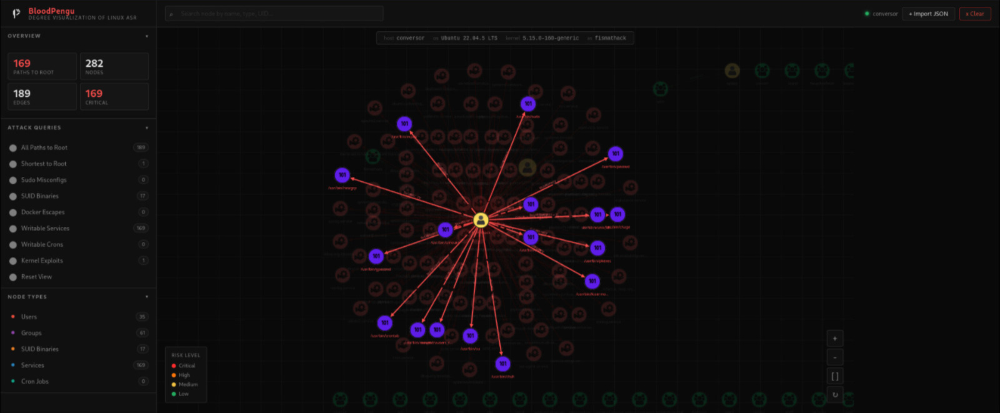
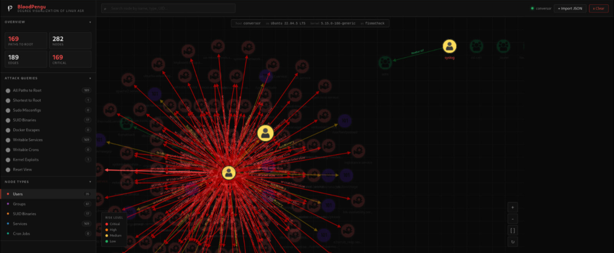
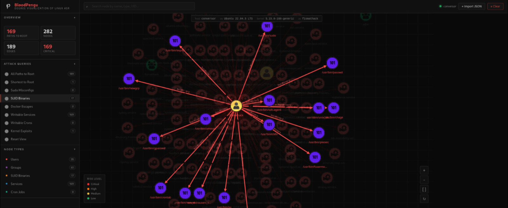
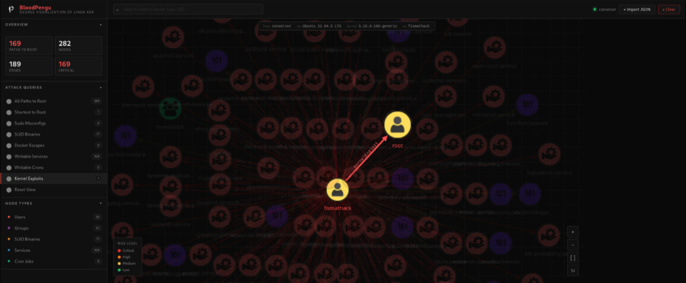

## BloodPengu SNIP and Usage 

```
v2.0.3
```

Identify and Eliminate Attack-paths on Linux based infra with Our APM.

<p align="center">
    <picture>
        
    </picture>
</p>

<p align="center">
    <picture>
        
    </picture>
</p>

<p align="center">
    <picture>
        
    </picture>
</p>

<p align="center">
    <picture>
        
    </picture>
</p>

## CONTACT

For more, come to the documentation for use cases and write-ups [here](https://pengu-apm.github.io/), if there's any security concern, please contact me at <byt3n33dl3@pm.me>